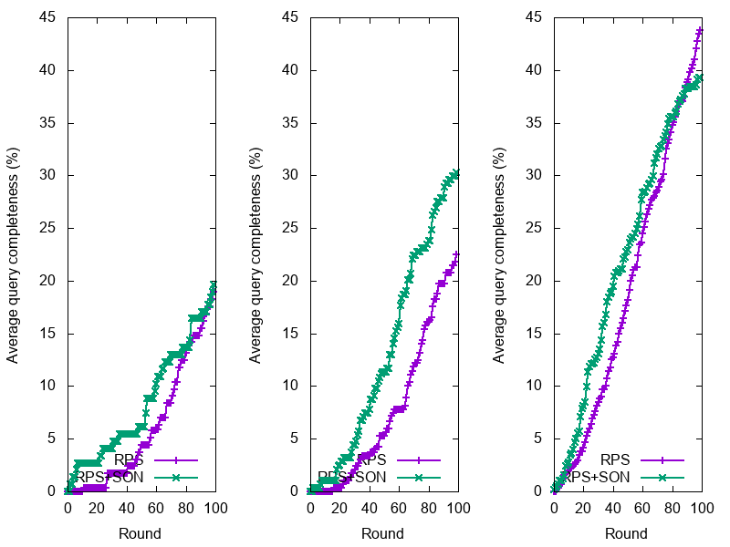
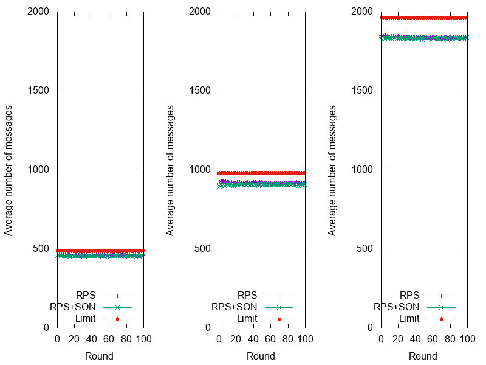
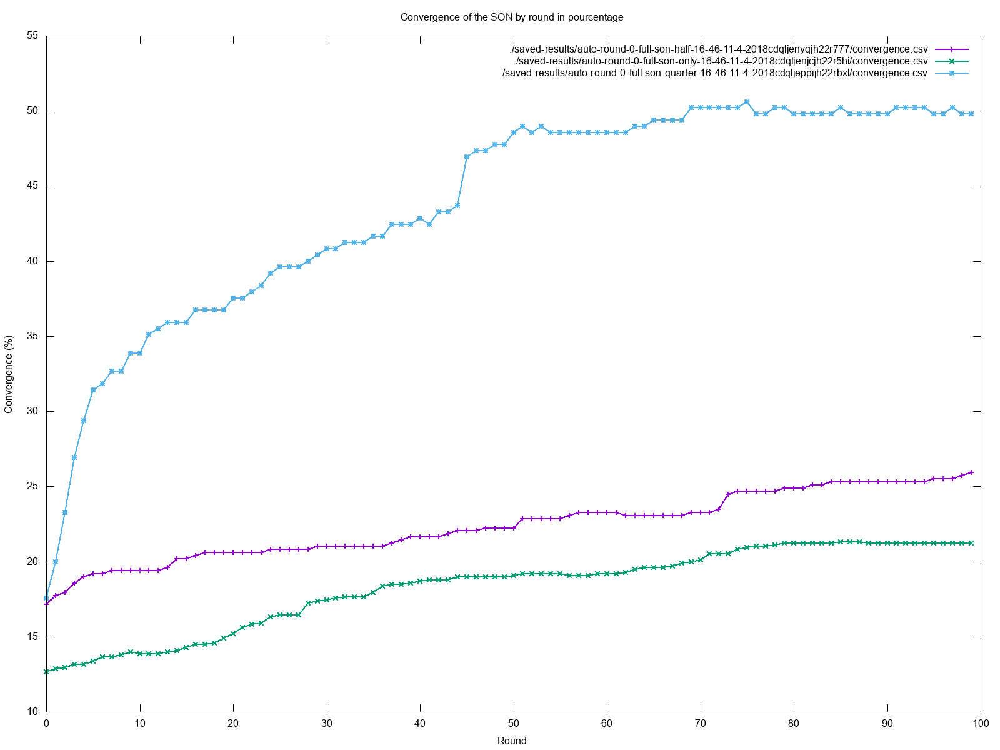
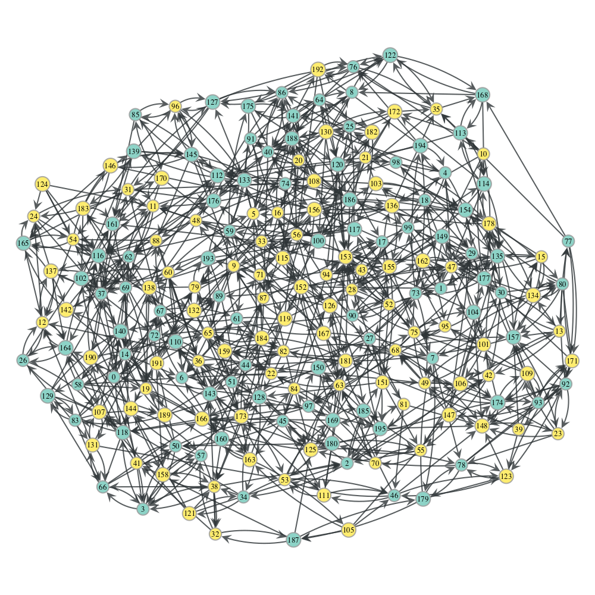
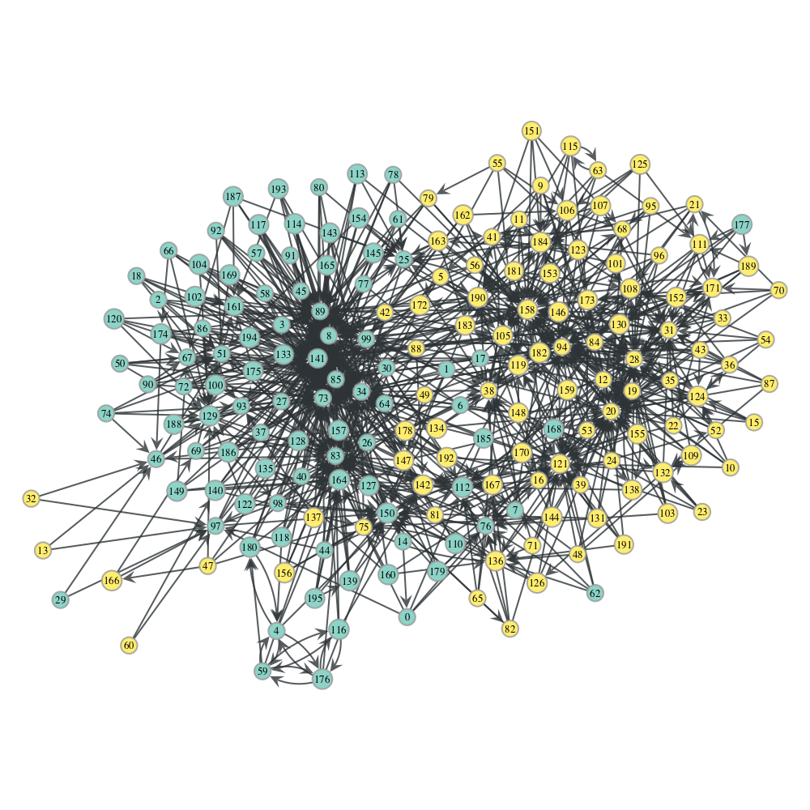

# SPARQL Query Execution in Networks of Web Browsers

Snob is a SPARQL query execution model over data hosted in a network of browsers

Submitted at:
* DeSemWeb Workshop for ISWC 2018 **accepted** for publication in CEUR-WS
* Poster **accepted** at ISWC 2018 Posters & Demonstrations and Industry Tracks for publication in CEUR-WS

The proceedings of the Posters and Demos track will be published jointly with the accepted submissions to the industry track through CEUR-WS.

Paper link: [http://hal.univ-nantes.fr/hal-01805154](http://hal.univ-nantes.fr/hal-01805154)

OpenReview: [https://openreview.net/forum?id=B1aJkYFRf](https://openreview.net/forum?id=B1aJkYFRf)

## Perspectives (Implementation)

Please, if you want to to use this Query Execution Model in your application, consider to move the storage to another system other than Rdfstore-js.

Consider [sparql-engine](https://github.com/callidon/sparql-engine) to build the SNOB approach that is:
- Send Triples patterns (TPs) to neighbours (by sending only message per neighbour)
- Store (replicate) received triples matching TPs in a local datastore, (consider the N3.js example of sparql-engine, or use your own.)
- Execute the Query on the local datastore,
- Wait for a new shuffling to get new neighbours, re-execute again the model.


## Simulation

In the paper, we present an experiment using a prototype implemented in Javascript/NodeJS that can be used in a browser.
We also provide a simulation in addition to these experiments. (https://github.com/folkvir/snob-simulation)
The simulation uses the Peer-Sim[1] simulator and also provides similar results.
But compared to our experiments we are able to reach the 100% of query completeness in our network.

## Network

This client relies on Cyclon [2] as random peer sampling network and T-Man [3] with our own similarity metric to cluster clients.

The client use [foglet-core](https://github.com/ran3d/foglet-core) as network manager which use easy WebRTC communication primitives.

## Data storage
The local data store of each client relies on a modified version of [Rdfstore-js](https://github.com/antoniogarrote/rdfstore-js) which can be found [here](https://github.com/folkvir/rdfstore-js). The modified version allows long running queries.

# Install

```
git clone --recurse-submodules https://github.com/chaconinc/MainProject
// or git clone https://github.com/folkvir/webrtc-dequenpeda.git
// git submodule init
// git submodule update
cd webrtc-dequenpeda
npm install
```

# Create your web-app with the client
```
# from root folder
npm run build
# now check in dist/ folder to include the bundle into your web-app
```
Don't forget to run a signaling server (see [foglet-signaling-server](https://github.com/ran3d/foglet-signaling-server))

# Tests

In order to just test the model execute the following command after installing the package:
```
# before:
npm install
# execute:
npm test
```

It will simulate a local network of 10 peers connected through Cyclon and a SON where each peers load and execute queries on
the dataset DISEASOME.
It will produce results into the results folder.

- Number of nodes(queries): 10
- Number of rounds: 20
- Max view size: 5
- Semantic Overlay activated: No (it shows the effectiveness of the replication)

# Experimental Results

## Data
All data can be found in the data folder. You will found any query used for this experiments. All data fragments, all construct queries used to create these data fragments, all query results, and all .HDT file if necessary.

## Results

Results can be found in the tests/saved-results folder. You will found 3 successive runs of each experiment with the RPS and RPS+SON configurations and the 3 different query distribution configuration (quarter, half, all). For a total of 6 experiment per run. For a total of 18 experiments.

For example, following CSVs represent the average of 3 runs for the 6 experiments:
- [ALL-RPS](tests/saved-results/full-rps-global-completeness.csv)
- [ALL-RPS+SON](tests/saved-results/full-son-only-global-completeness.csv)
- [HALF-RPS](tests/saved-results/full-half-global-completeness.csv)
- [HALF-RPS+SON](tests/saved-results/full-son-half-global-completeness.csv)
- [QUARTER-RPS](tests/saved-results/full-quarter-global-completeness.csv)
- [QUARTER-RPS+SON](tests/saved-results/full-son-quarter-global-completeness.csv)


### Average completeness by round

Average query completeness by round for different queries number with RPS, RPS+SON network configuration. Left to right respectively 49 (quarter), 98 (half) and 196 (all) queries.



### Average number of messages by round

Average number of messages by round for different queries number with RPS, RPS+SON network configuration. Left to right respectively 49 (quarter), 98 (half) and 196 (all) queries.



### SON Convergence (Additional experiments)



### Network visualization
The evolution of the RPS and SON networks with 196 queries (all). LinkedMDB in Yellow and Diseasome in Blue.

Following image represents the Random Peer Sampling used in our model. We rely on Cyclon[1]



Following image represents the Semantic Overlay Network used in our model. It relies on T-Man[2]




# References

**[1]** Alberto Montresor and Mark Jelasity. PeerSim: A scalable P2P simulator. In Proc. of the 9th Int. Conference on Peer-to-Peer (P2P’09), pages 99–100. Seattle, WA, September 2009.

**[2]** Voulgaris,S.,Gavidia,D.,VanSteen,M.:CYCLON:inexpensivemembershipman- agement for unstructured P2P overlays. Journal of Network and Systems Manage-
ment 13(2), 197–217 (2005)

**[3]** JELASITY, Márk et BABAOGLU, Ozalp. T-Man: Gossip-based overlay topology management. In : International Workshop on Engineering Self-Organising Applications. Springer, Berlin, Heidelberg, 2005. p. 1-15.
