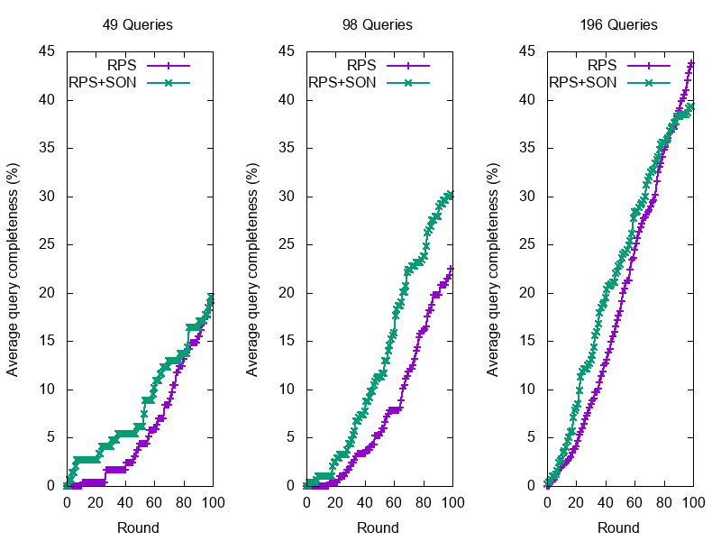
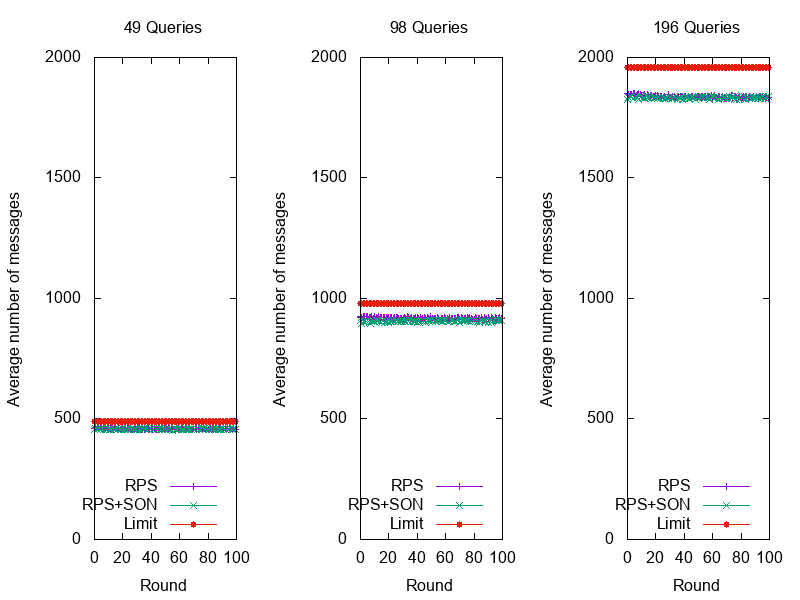

# SPARQL Query Execution in Networks of Web Browsers

Snob is a SPARQL query execution model over data hosted in a network of browsers

## Network

This client relies on Cyclon [1] as random peer sampling network and T-Man [2] with our own similarity metric to cluster clients.

The client use [foglet-core](https://github.com/ran3d/foglet-core) as network manager which use easy WebRTC communication primitives.

## Data storage
The local data store of each client relies on a modified version of [Rdfstore-js](https://github.com/antoniogarrote/rdfstore-js) which can be found [here](https://github.com/folkvir/rdfstore-js). The modified version allows long running queries.

# Install

```
git clone --recurse-submodules https://github.com/chaconinc/MainProject
// or git clone https://github.com/folkvir/webrtc-dequenpeda.git
// git submodule init
// git submodule update
cd webrtc-dequenpeda
npm install
```

# Create your web-app with the client
```
# from root folder
npm run build
# now check in dist/ folder
```

# Experimental Results

## Data
All data can be found in the data folder. You will found any query used for this experiments. All data fragments, all construct queries used to create these data fragments, all query results, and all .HDT file if necessary.

## Results

Results can be found in the tests/saved-results folder. You will found 3 successive runs of each experiment with the RPS and RPS+SON configurations and the 3 different query distribution configuration (quarter, half, all). For a total of 6 experiment per run. For a total of 18 experiments.

For example, following CSVs represent the average of 3 runs for the 6 experiments:
- [ALL-RPS](tests/saved-results/full-rps-global-completeness.csv)
- [ALL-RPS+SON](tests/saved-results/full-son-only-global-completeness.csv)
- [HALF-RPS](tests/saved-results/full-half-global-completeness.csv)
- [HALF-RPS+SON](tests/saved-results/full-son-half-global-completeness.csv)
- [QUARTER-RPS](tests/saved-results/full-quarter-global-completeness.csv)
- [QUARTER-RPS+SON](tests/saved-results/full-son-quarter-global-completeness.csv)


### Average completeness by round

Average query completeness by round for different queries number with RPS, RPS+SON network configuration. Left to right respectively 49 (quarter), 98 (half) and 196 (all) queries.



### Average number of messages by round

Average number of messages by round for different queries number with RPS, RPS+SON network configuration. Left to right respectively 49 (quarter), 98 (half) and 196 (all) queries.



### Network visualization
The evolution of the RPS and SON networks with 196 queries (all). LinkedMDB in Yellow and Diseasome in Blue.

Following image represents the Random Peer Sampling used in our model. We rely on Cyclon[1]


Following image represents the Semantic Overlay Network used in our model. It relies on T-Man[2]


# References

**[1]** Voulgaris,S.,Gavidia,D.,VanSteen,M.:CYCLON:inexpensivemembershipman- agement for unstructured P2P overlays. Journal of Network and Systems Manage-
ment 13(2), 197–217 (2005)

**[2]** JELASITY, Márk et BABAOGLU, Ozalp. T-Man: Gossip-based overlay topology management. In : International Workshop on Engineering Self-Organising Applications. Springer, Berlin, Heidelberg, 2005. p. 1-15.
