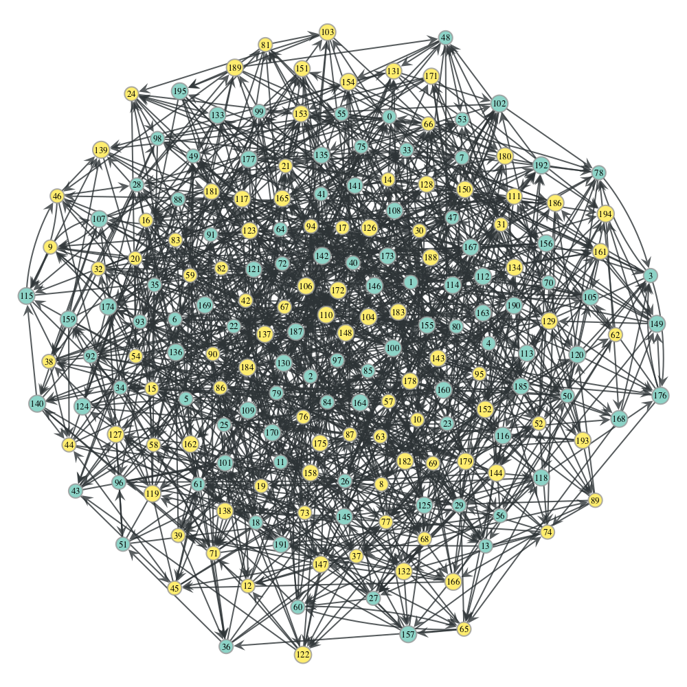

# Graphs Visualization
All graphs are drawn with graph-tool (python3)
```bash
brew install graph-tool
```

# Usage

`python3 graph.py <file> [rps|overlay]`

For example with the file 159-neighbors.json it produces the following figures with:

`python3 graph.py ./neighbors/159-neighbors.json rps`



`python3 graph.py ./neighbors/159-neighbors.json overlay`


